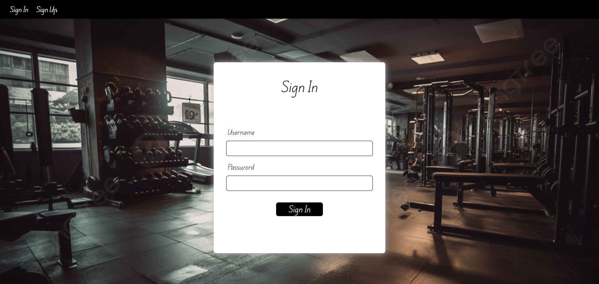
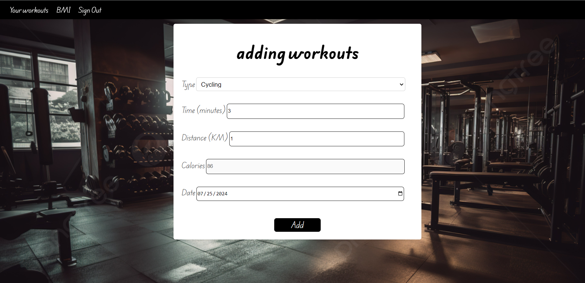
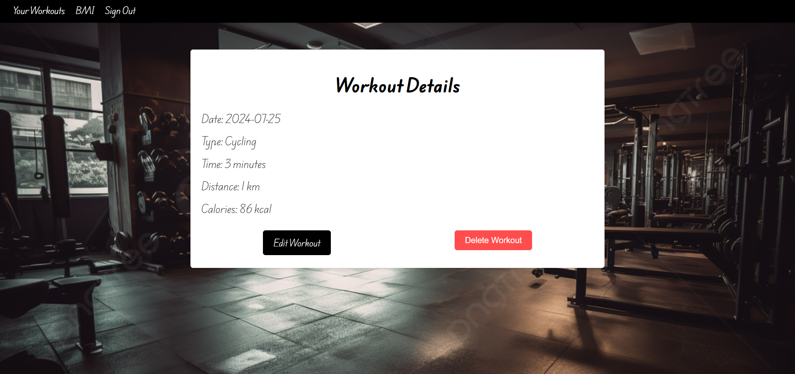

# Fitness-Log

## by : Mueen Ali

### Scope :
an application to track your workouts , where you can add/edit workouts and calculate its calories 

#### a link to deployed app [here](https://fitness-log-8da007ba5e00.herokuapp.com/)

feature to add :

- [x] add weight/height and see the BMI 

- [ ] create a plan of workouts and see plan calories .

- [ ] add more exercises

### Trello Project Planning [here](https://trello.com/b/OpzPZ7t5/fitness-log)

## technologies used 
- javascript
- css
- html
- EJS
- node

## pictures from the app

